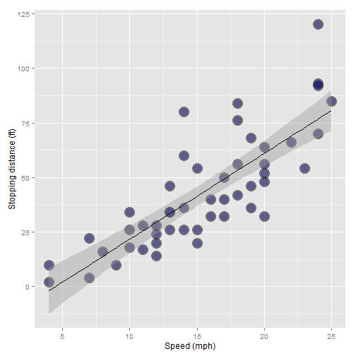

## Purpose

This app will help predict how long it takes for a car to stop depending on fast it's traveling.   

## Data

The data used for this app is from the cars dataset from the R datasets packages. The data give the speed of cars and the distances taken to stop. The format of the dataset is data frame with 50 observations on 2 variables.

1. Speed (mph)
2. Stopping distance (ft) 

---

## Analysis

We are going to use a simple linear regression model for our calculation.

```r
require(ggplot2)
```

```
## Loading required package: ggplot2
```

```r
g = ggplot(cars, aes(x = speed, y = dist))
g = g + xlab("Speed (mph)")
g = g + ylab("Stopping distance (ft)")
```

---


```r
g = g + geom_point(size = 7, colour = "black", alpha=0.5)
g = g + geom_point(size = 5, colour = "blue", alpha=0.2)
g = g + geom_smooth(method = "lm", colour = "black")
g
```

 

---


```r
model <- lm(dist ~ speed, cars)
model$coeff
```

```
## (Intercept)       speed 
##  -17.579095    3.932409
```


## Predict

Now we are going to use the coefficients out of the model to predict using the very basic formula:
y = y_intercept + speed * x. Please use the app in order to predict what the stopping distance would be given the speed of the car.
